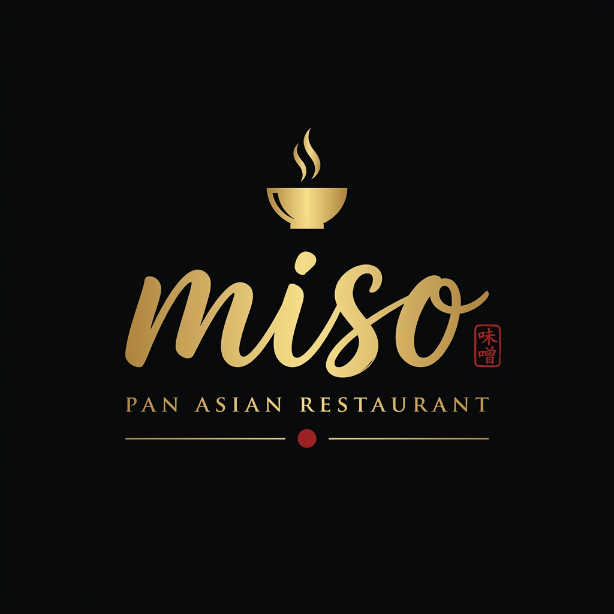
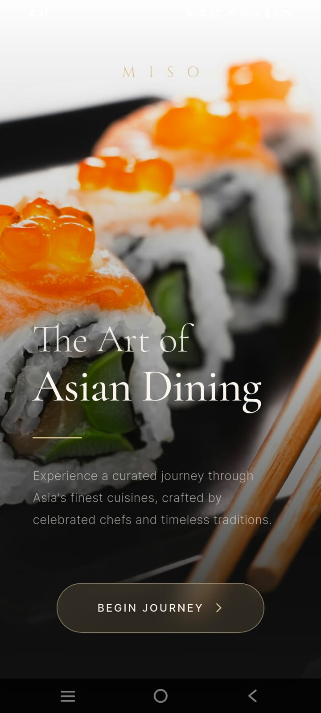
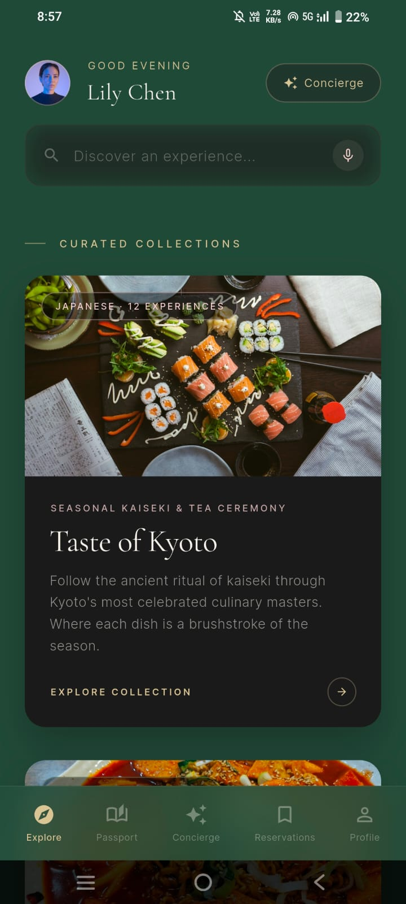
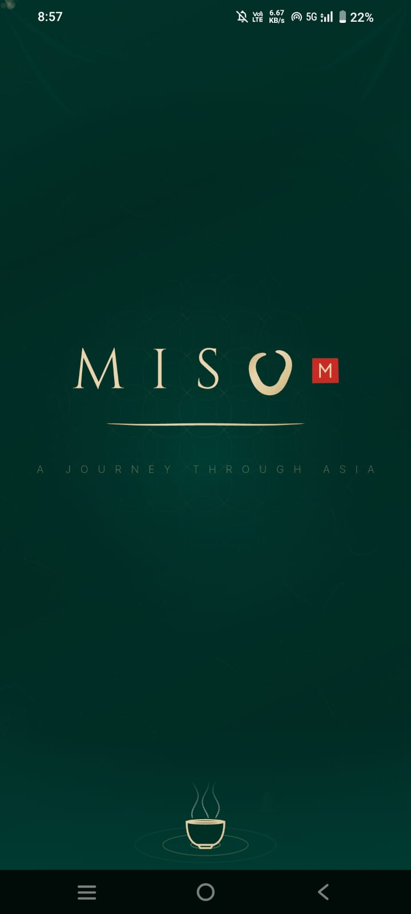
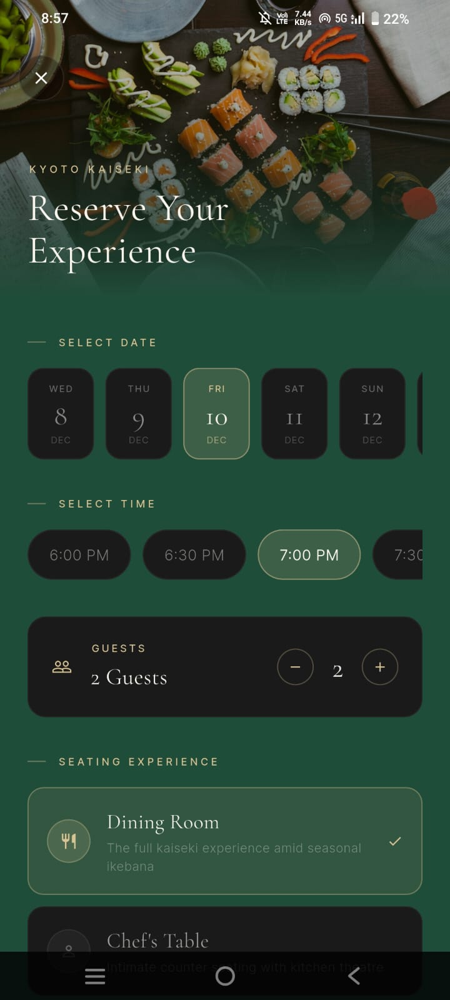
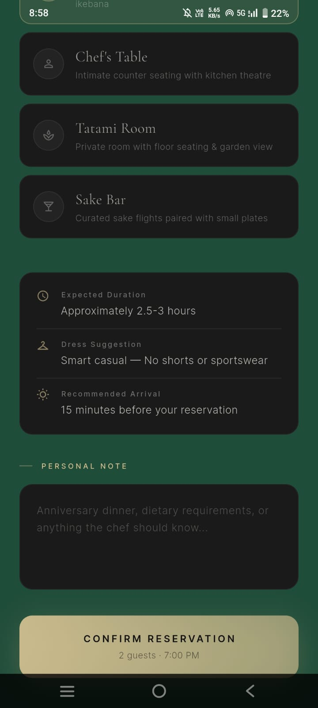
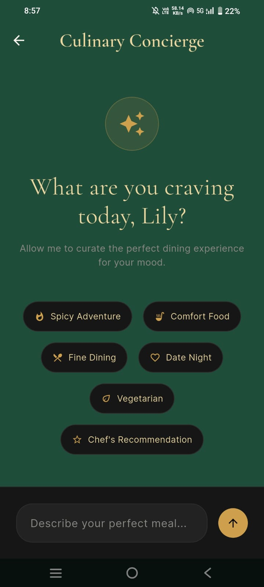
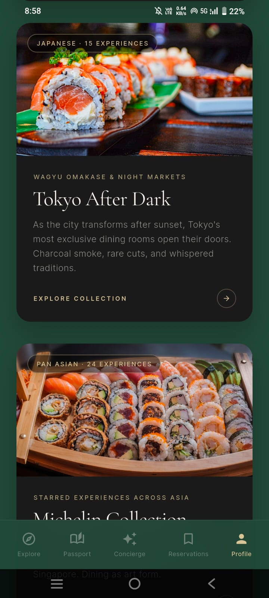
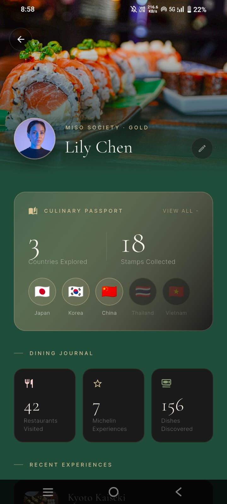

<div align="center">

<br/>



# MISO

### *Dining should feel memorable long before the first dish arrives.*

<br/>

[](https://flutter.dev)
[](https://dart.dev)
[](https://firebase.google.com)
[](https://riverpod.dev)
[](LICENSE)

<br/>

</div>

---

## ✦ About

**MISO** was built on a simple idea — dining should feel memorable long before the first dish arrives.

Inspired by the richness of Asian cuisine, MISO blends modern technology with luxury hospitality to create an immersive experience for discovering restaurants, reserving tables, and exploring thoughtfully curated menus with effortless elegance.

Imagine if **Apple**, **Aman Resorts**, **Airbnb Experiences**, the **Michelin Guide**, and **Muji** collaborated to create a dining platform. The result is MISO — a beautifully curated Asian lifestyle magazine where every restaurant tells a story, every dish has heritage, and every interaction creates anticipation.

---

## ✦ Screenshots

<br/>

<div align="center">

| | | |
|:---:|:---:|:---:|
|  |  |  |
| *Onboarding* | *Home* | *Explore* |
|  |  |  |
| *Country Detail* | *Restaurant* | *Menu* |
|  |  |  |
| *Reservations* | *Culinary Passport* | *AI Concierge* |

</div>

---

## ✦ Core Philosophy

| Principle | Description |
|---|---|
| 🎨 **Editorial over Transactional** | Immersive curated collections — *"Taste of Kyoto"*, *"Hidden Gems of Seoul"*, *"Tokyo After Dark"* — replacing generic listings |
| 🗺️ **The Culinary Passport** | Progress through the app like a luxury travel journal. Every country explored is a beautifully designed passport page. Every restaurant visited is a collectible stamp |
| 🏯 **Cultural Adaptability** | Subtly adapts to each cuisine's culture — sakura and bamboo for Japan, jade and silk for China, celadon for Korea |
| 🎬 **Cinematic Restaurant Pages** | Restaurants are luxury destinations, presented through their philosophy, chef introductions, and architecture before ever showing a menu |
| 📖 **Editorial Menus** | Dishes presented with ingredient sourcing, preparation techniques, regional history, and chef commentary |
| 🏨 **Ceremonial Reservations** | Booking feels like reserving a luxury hotel — seating maps, ambient previews, and elegant visual feedback |
| 🤖 **AI Concierge** | Natural AI integration recommending experiences based on mood, season, weather, and travel preferences |
| ✨ **Artisanal Motion Design** | Flowing ink animations, gently drifting particles, soft steam, subtle parallax, and fluid 60fps micro-interactions |

---

## ✦ Features

- 🌏 **Pan-Asian Discovery** — Browse curated restaurants across Japan, China, Korea, Thailand, India, and more
- 🔍 **Immersive Explore** — Editorial collections and cultural deep-dives into each cuisine
- 🗓️ **Luxury Reservations** — Seamless, ceremonial table booking with seating maps
- 🛎️ **AI Concierge** — Personalized dining recommendations powered by AI
- 🧳 **Culinary Passport** — Gamified journey through Asian culinary cultures with collectible stamps
- 📋 **Editorial Menus** — Rich dish stories with sourcing, heritage, and chef commentary
- 👤 **Profile & History** — Your dining journey beautifully archived
- 🎵 **Ambient Audio** — Subtle soundscapes that match the mood of each cuisine

---

## ✦ Tech Stack

| Layer | Technology |
|---|---|
| **Framework** | Flutter 3.x (Dart 3.x) |
| **State Management** | Riverpod 2.x + Riverpod Generator |
| **Navigation** | Go Router 13.x |
| **Backend / Auth** | Firebase Core + Firebase Auth |
| **Networking** | Dio 5.x |
| **Animations** | Flutter Animate + Lottie |
| **Fonts** | Google Fonts |
| **Image Caching** | Cached Network Image |
| **Code Generation** | Freezed + JSON Serializable + Build Runner |
| **Audio** | Just Audio |

---

## ✦ Project Structure

```
miso/
├── lib/
│   ├── core/              # Theme, typography, constants, routing
│   ├── features/
│   │   ├── onboarding/    # Welcome & intro screens
│   │   ├── home/          # Home feed & editorial collections
│   │   ├── explore/       # Country & cuisine discovery
│   │   ├── reservations/  # Table booking flow
│   │   ├── orders/        # Order history & tracking
│   │   ├── concierge/     # AI Concierge chat
│   │   └── profile/       # Culinary passport & profile
│   └── shared/            # Shared widgets, models, utilities
├── assets/
│   ├── images/            # App imagery
│   ├── icons/             # Custom icon set
│   └── lottie/            # Animation files
├── docs/                  # Vision, PRD & design documentation
└── Sceenshots/            # App screenshots
```

---

## ✦ Getting Started

### Prerequisites

- Flutter SDK `>=3.3.0`
- Dart SDK `>=3.0.0`
- Firebase project configured ([setup guide](https://firebase.google.com/docs/flutter/setup))

### Installation

```bash
# 1. Clone the repository
git clone https://github.com/swatalina-palar/MISO.git
cd MISO

# 2. Install dependencies
flutter pub get

# 3. Run code generation
dart run build_runner build --delete-conflicting-outputs

# 4. Run the app
flutter run
```

---

## ✦ Design Language

MISO's visual identity is anchored in:

- **Abundant whitespace** — every screen breathes with calm intentionality
- **Ultra-thin premium line icons** — delicate, handcrafted, precise
- **Handcrafted textures** — rice paper, bamboo, ceramics, silk
- **8-point grid system** — rigorous spatial harmony
- **Refined typography** — curated Google Fonts with editorial hierarchy
- **Depth over decoration** — subtle shadows, layered surfaces, tactile materials

> *"Every screen should feel calm, intentional, timeless, and sophisticated. It should make users feel they are beginning a memorable journey through the diverse culinary cultures of Asia."*

---

## ✦ License

This project is licensed under the MIT License — see the [LICENSE](LICENSE) file for details.

---

<div align="center">

<br/>

*Crafted with care for those who believe dining is an art.*

**MISO** — *味噌*

<br/>

</div>
